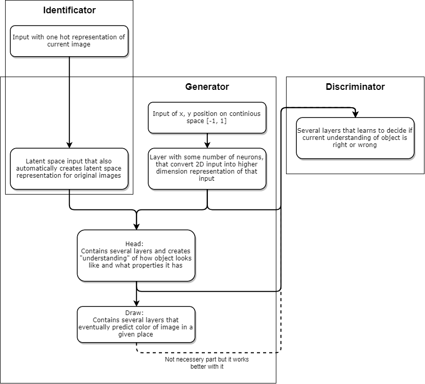
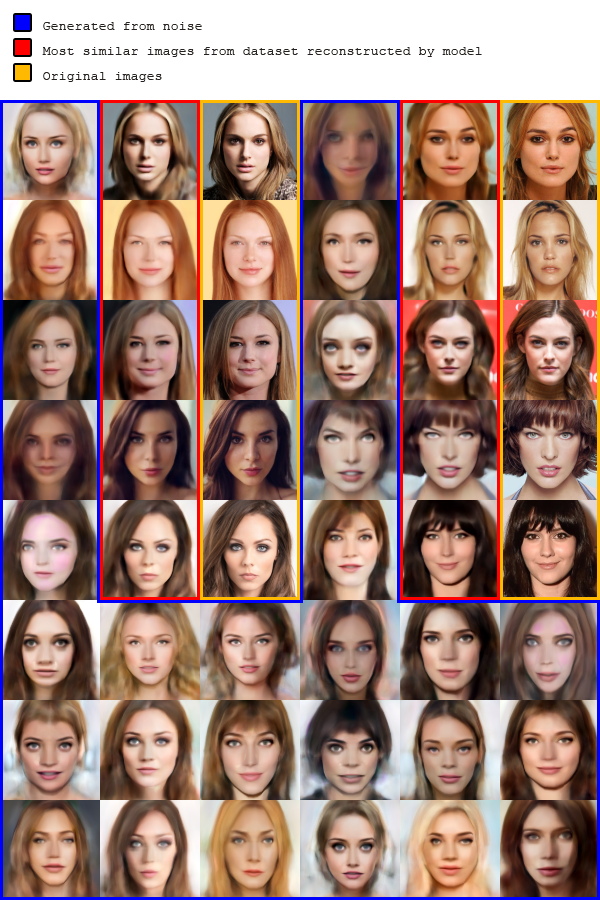

# ConGAN
Continuous Adversarial Image Generator that can produce good images with relatively small number of examples and without any resolution dependencies.

While training it creates small examples of generated images into 'images/' folder and saves current model into 'saved_model/' folder. After traning you only need "Generator" part of the model to produce new images.

#### Model structure:  
  

#### Results example:
- Faces: 100 examples, 20-dimensional latent space (similarity calculated from euclidean distance in latent space) 
  
- Shoes: 50 examples, 50-dimentional latent space  
[shoes_table.png](shoes_table.png) [[original set](shoes.png)]
- Animals: 30 examples, 10-dimentional latent space  
[animals_table.png](animals_table.png) [[original set](animals.png)]
